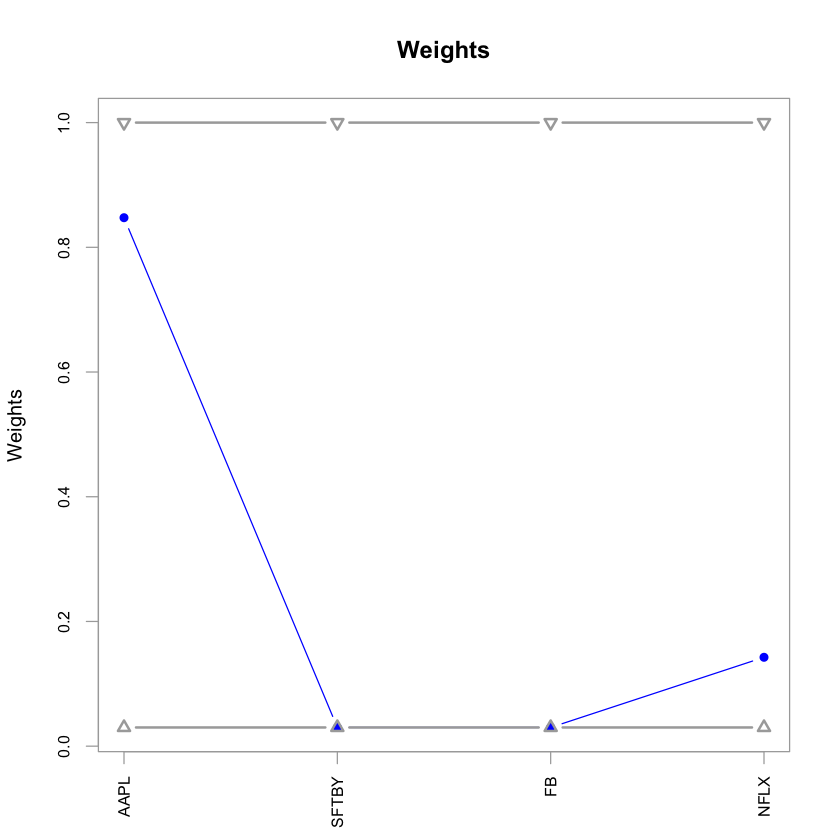
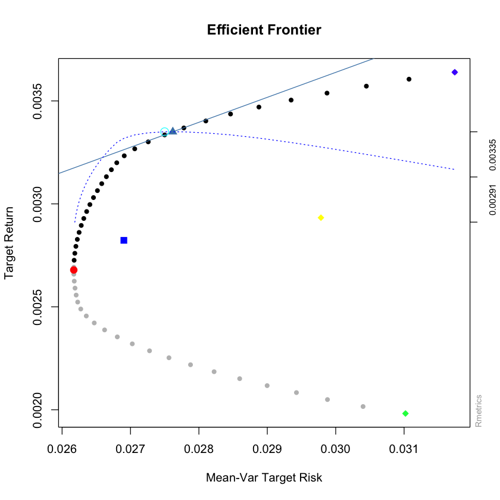

## Portfolio management using Markowitz optimization methodology
To use this project, provide the following information in the attached Excel sheet "Stocks_List.xlsx":

1. Tickers:  Enter tickers of the existing companies in your portfolio (e.g. AAPL for Apple)
2. Quantity: Enter the quantity of stocks owned for each company

The output is the best combination of stocks which minimizes the risk through minimizing the dependecies between the stocks in the portolio.


```R
## Importing required libraries
library(fPortfolio)
library(readxl)
library(ggplot2)
library(dplyr)
library(quantmod)
library(PerformanceAnalytics)
library(PortfolioAnalytics)
library(ROI)
library(ROI.plugin.quadprog)
library(ROI.plugin.glpk)
library(zoo)
```

    Loading required package: timeDate
    
    Loading required package: timeSeries
    
    Loading required package: fBasics
    
    Loading required package: fAssets
    
    
    Attaching package: ‘dplyr’
    
    
    The following objects are masked from ‘package:timeSeries’:
    
        filter, lag
    
    
    The following objects are masked from ‘package:stats’:
    
        filter, lag
    
    
    The following objects are masked from ‘package:base’:
    
        intersect, setdiff, setequal, union
    
    
    Loading required package: xts
    
    Loading required package: zoo
    
    
    Attaching package: ‘zoo’
    
    
    The following object is masked from ‘package:timeSeries’:
    
        time<-
    
    
    The following objects are masked from ‘package:base’:
    
        as.Date, as.Date.numeric
    
    
    
    Attaching package: ‘xts’
    
    
    The following objects are masked from ‘package:dplyr’:
    
        first, last
    
    
    Loading required package: TTR
    
    
    Attaching package: ‘TTR’
    
    
    The following object is masked from ‘package:fBasics’:
    
        volatility
    
    
    Registered S3 method overwritten by 'quantmod':
      method            from
      as.zoo.data.frame zoo 
    
    Version 0.4-0 included new data defaults. See ?getSymbols.
    
    
    Attaching package: ‘PerformanceAnalytics’
    
    
    The following objects are masked from ‘package:timeDate’:
    
        kurtosis, skewness
    
    
    The following object is masked from ‘package:graphics’:
    
        legend
    
    
    Loading required package: foreach
    
    Registered S3 method overwritten by 'ROI':
      method           from              
      print.constraint PortfolioAnalytics
    
    ROI: R Optimization Infrastructure
    
    Registered solver plugins: nlminb, glpk, quadprog.
    
    Default solver: auto.
    
    
    Attaching package: ‘ROI’
    
    
    The following objects are masked from ‘package:PortfolioAnalytics’:
    
        is.constraint, objective
    
    
    The following object is masked from ‘package:fBasics’:
    
        vech
    
    


## Get stock prices


```R
## Insert initial date and Risk Free rate
initial_day='2020-01-01'
rf=0
## Get the tickers from Excel sheet
stocks_list <- as.data.frame(read_excel("Stocks_List.xlsx"))
tickers <- t(stocks_list[[1]])
```


```R
## Get Prices (can be daily, weekly or monthly)
stocks_prices <- NULL
for (Ticker in tickers){
  stocks_prices <- na.approx(cbind(stocks_prices,
                           getSymbols.yahoo(Ticker, from=initial_day, periodicity = "daily", auto.assign=FALSE)[,4])
  )
}

## Set your benchmark, default="SPY" 
bench_prices <- getSymbols.yahoo("SPY", from=initial_day, periodicity = "daily", auto.assign=FALSE)[,4]

## Create data frames for the Benchmark Prices (S&P500 in this case) and focused stocks
stocks_prices <- data.frame(date=index(stocks_prices), coredata(stocks_prices))
bench_prices <- data.frame(date=index(bench_prices), coredata(bench_prices))

## Setting date as index for both data frames
rownames(stocks_prices) <- stocks_prices$date
rownames(bench_prices) <- bench_prices$date
stocks_prices$date <- NULL
bench_prices$date <- NULL
colnames(stocks_prices) <- tickers
colnames(bench_prices) <- "SPY"
```


```R
## Print the number of NA values to check discrepencies
## Evaluate the steps taken, if any non-zero number detected
colSums(cbind(is.na(bench_prices),is.na(stocks_prices)))
```


<style>
.dl-inline {width: auto; margin:0; padding: 0}
.dl-inline>dt, .dl-inline>dd {float: none; width: auto; display: inline-block}
.dl-inline>dt::after {content: ":\0020"; padding-right: .5ex}
.dl-inline>dt:not(:first-of-type) {padding-left: .5ex}
</style><dl class=dl-inline><dt>SPY</dt><dd>0</dd><dt>AAPL</dt><dd>0</dd><dt>SFTBY</dt><dd>0</dd><dt>FB</dt><dd>0</dd><dt>NFLX</dt><dd>0</dd></dl>


## Calculate daily returns


```R
## Use only if you need to manipulate the data manually on Excel
## Create an Excel sheet of "stocks_prices" data frame
#write.xlsx(as.data.frame(stocks_prices), "result.xlsx", sheetName = "Sheet1",col.names = TRUE, row.names = TRUE)
#stocks_prices <- as.data.frame(read_excel("result.xlsx"))
#rownames(stocks_prices) <- stocks_prices[,1]
#stocks_prices[,1]<-NULL
#colSums(cbind(is.na(bench_prices),is.na(stocks_prices)))
```


```R
## Weights of stock in the Current Portfolio
quants_prior <- stocks_list[[2]]
weights_prior <- quants_prior*tail(stocks_prices,1)/
  sum(stocks_list[[2]]*tail(stocks_prices,1))


## Calculate Returns For each company
stocks_daily_returns <- na.omit(ROC(stocks_prices, type="discrete"))
bench_daily_returns <- na.omit(ROC(bench_prices, type="discrete"))

colnames(stocks_daily_returns) <- tickers
colnames(bench_daily_returns) <- "SPY"
```

## Optimization model


```R
## Depending on number of stocks in your portfolio, you need to try different values for min, max, min_sum, max_sum
portf <- portfolio.spec(colnames(stocks_daily_returns))

portf <- add.constraint(portf, type="weight_sum", min_sum=.95, max_sum=1.05)
portf <- add.constraint(portf, type="long_only")
portf <- add.constraint(portf, type="box", min=.03, max=1)
portf <- add.objective(portf, type="return", name="mean")
portf <- add.objective(portf, type="risk", name="StdDev")

## In this example, "ROI" is used as the solver. The method can be changed to "DEoptim", "random", "pso", "GenSA".
## Choosing the best solver is out of scope of this project
optPort <- optimize.portfolio(stocks_daily_returns, portf, optimize_method = "ROI",trace=TRUE)
```

## Numerical results


```R
## Weights of stock in the Optimized Portfolio
weights_opt <- extractWeights(optPort)
chart.Weights(optPort)

## Quantity of stock in the Optimized Portfolio
quants_opt <- round(weights_opt*sum(stocks_list[[2]]*
                      tail(stocks_prices,1))/tail(stocks_prices,1))

## Since the numbers for quantities are rounded there is a difference between the value of total 
##  investments before and after the optimization process. The difference is:
#diff_invest <- sum((quants_opt-quants_prior)*tail(stocks_prices,1))
```





## Rebalancer


```R
# The quantity of each stock to buy (+) or sell (-) to get to the Optimized Portfolio
buy_or_sell <- t(quants_opt-quants_prior)
buy_or_sell <- as.data.frame(cbind(buy_or_sell,buy_or_sell * t(tail(stocks_prices,1))))
colnames(buy_or_sell) <- c('Buy/Sell_qts','Amount')
buy_or_sell <- buy_or_sell[order(abs(buy_or_sell['Amount']),decreasing = TRUE),]
buy_or_sell
```


<table>
<caption>A data.frame: 4 × 2</caption>
<thead>
	<tr><th></th><th scope=col>Buy/Sell_qts</th><th scope=col>Amount</th></tr>
	<tr><th></th><th scope=col>&lt;dbl&gt;</th><th scope=col>&lt;dbl&gt;</th></tr>
</thead>
<tbody>
	<tr><th scope=row>AAPL</th><td> 4</td><td> 1989.92</td></tr>
	<tr><th scope=row>NFLX</th><td>-3</td><td>-1476.93</td></tr>
	<tr><th scope=row>SFTBY</th><td>-4</td><td> -119.24</td></tr>
	<tr><th scope=row>FB</th><td> 0</td><td>    0.00</td></tr>
</tbody>
</table>


## Visualizations


```R
## Graph the Efficient Frontier
## 1: Efficient Frontier
## 2: Minimum variance portfolio
## 3: Tangency portfolio
## 4: Risk returns of each asset
## 5: Equal weight portfolio
## 6: Two asset frontiers (Long)
## 7: Mont Carlo portfolios
## 8: Sharpe Ratio

effFrontier <- portfolioFrontier(as.timeSeries(stocks_daily_returns),constraints = "LongOnly")
plot(effFrontier,c(1,2,3,4,5,8))


## Calculate Portfolio Returns
portfolioReturn <-    as.matrix(stocks_daily_returns)  %*%  as.matrix(t(weights_prior)) 
Opt_portfolioReturn <- as.matrix(stocks_daily_returns)  %*%  as.matrix(weights_opt) 

rets_df <- cbind(portfolioReturn, Opt_portfolioReturn, bench_daily_returns)
colnames(rets_df) = c("Old_Portfolio","Optimized","SPY")


## Plot Performance
charts.PerformanceSummary(as.xts(rets_df),Rf=rf,methods = "none",main="Performance Before vs. After")
```





## Performance results


```R
## Sharpe Ratio comparision between before and after optimization

SharpeRatio(
  as.xts(rets_df),
  Rf=rf,
  p = 0.95,
  FUN = c("StdDev", "VaR", "ES"),
)
```


<table>
<caption>A matrix: 3 × 3 of type dbl</caption>
<thead>
	<tr><th></th><th scope=col>Old_Portfolio</th><th scope=col>Optimized</th><th scope=col>SPY</th></tr>
</thead>
<tbody>
	<tr><th scope=row>StdDev Sharpe (Rf=0%, p=95%):</th><td>0.11816239</td><td>0.11759692</td><td>0.023483721</td></tr>
	<tr><th scope=row>VaR Sharpe (Rf=0%, p=95%):</th><td>0.07290249</td><td>0.07801996</td><td>0.014171436</td></tr>
	<tr><th scope=row>ES Sharpe (Rf=0%, p=95%):</th><td>0.03978574</td><td>0.04544729</td><td>0.007629699</td></tr>
</tbody>
</table>


## Future progress
Using Apache Spark to Backtest the result presented.
